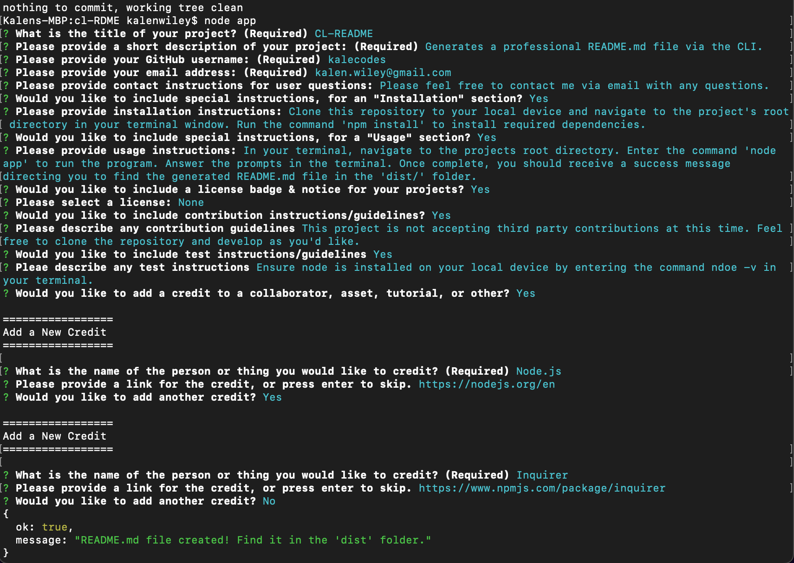
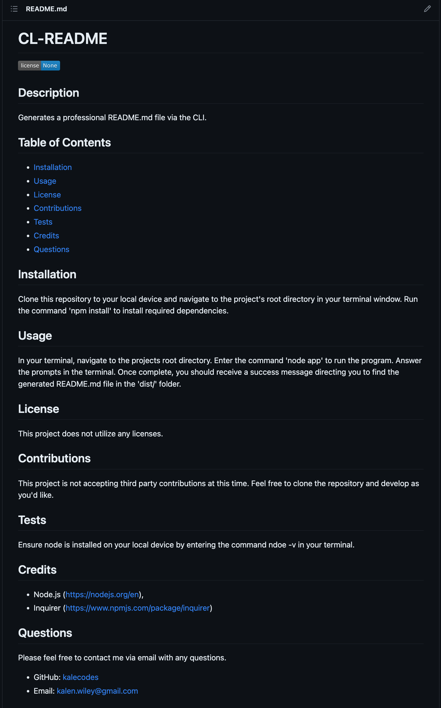

# CL-README

## Description

Generates a professional README.md file via the CLI.

## Table of Contents

* [Installation](#installation) 
* [Usage](#usage) 
* [License](#license) 
* [Contributions](#contributions) 
* [Tests](#tests) 
* [Credits](#credits)
* [Questions](#questions)
* [Screenshots](#screenshots)

## Installation

Clone this repository to your local device and navigate to the project's root directory in your terminal window. Run the command 'npm install' to install required dependencies. 
 

## Usage

In your terminal, navigate to the projects root directory. Enter the command 'node app' to run the program. Answer the prompts in the terminal. Once complete, you should receive a success message directing you to find the generated README.md file in the 'dist/' folder. 
 

## License

This project does not utilize any licenses.

## Contributions

This project is not accepting third party contributions at this time. Feel free to clone the repository and develop as you'd like.

## Tests

Ensure node is installed on your local device by entering the command ndoe -v in your terminal. 

## Credits

* Node.js (https://nodejs.org/en),
* Inquirer (https://www.npmjs.com/package/inquirer)

## Questions

Please feel free to contact me via email with any questions.
* GitHub: [kalecodes](https://github.com/kalecodes)
* Email: kalen.wiley@gmail.com

## Screenshots

